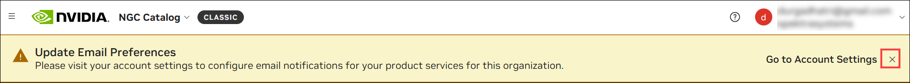
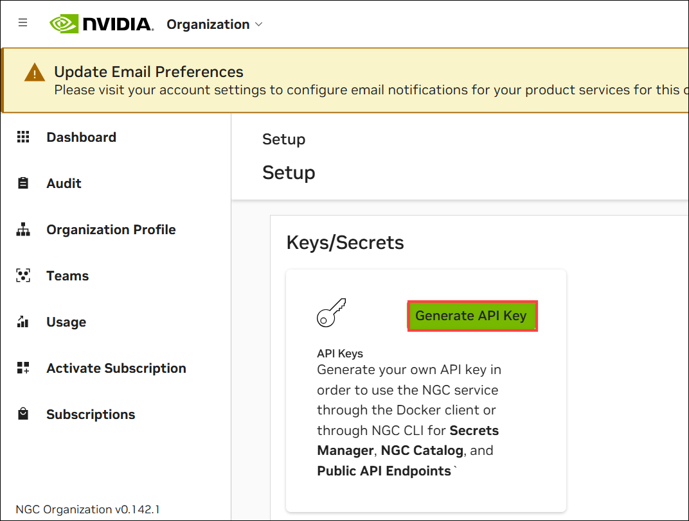

# Challenge 02: Deploy and Utilize NVIDIA Riva ASR on Azure

### Estimated Time: 45 Minutes

## Introduction

In this challenge, you will deploy and utilize NVIDIA Riva ASR (Automatic Speech Recognition) on an Azure GPU-enabled virtual machine. You will generate the necessary NVIDIA API keys, create and configure a GPU-enabled virtual machine in Azure, set up and run the NVIDIA Riva ASR container, and configure network security group rules for external access. This challenge aims to provide hands-on experience deploying AI models and using cloud resources to create AI-ready applications.

Riva ASR NIM APIs provide easy access to state-of-the-art automatic speech recognition (ASR) models for multiple languages. Riva ASR NIM models are built on the NVIDIA software platform, incorporating CUDA, TensorRT, and Triton to offer out-of-the-box GPU acceleration.

Riva ASR supports mono, 16-bit audio in WAV, OPUS, and FLAC formats. If you do not have a speech file, use a sample speech file embedded in the Docker container launched in the previous section.

## Prerequisites

- **NVIDIA AI Enterprise License**: Riva ASR NIM is available for self-hosting under the NVIDIA AI Enterprise (NVAIE) License.
- **NVIDIA GPU(s)**: Riva ASR NIM runs on any NVIDIA GPU with sufficient GPU memory (e.g., Standard NC4as_T4_v3).

## Challenge Objectives:

> **Note**: This challenge must be completed successfully as it is a prerequisite for Challenge 6. Ensure that all tasks and steps outlined in this challenge are executed properly and that the desired outcomes are achieved before proceeding to Challenge 6.

1. **Generate NGC API KEY**

   - Log in or create an Nvidia account 

   - Navigate to https://build.nvidia.com/ and log in using your personal email ID. If not, create an account.

   - Complete account verification to gain API access. Once verified, your rate limit will increase to 40 requests per minute (RPM).

       
   
   -  Navigate to [Nvidia](https://ngc.nvidia.com/signin) account using your credentials to proceed and Click on the **Continue**.

   - Once your account is created or you've successfully logged in.

   - If you see a warning like **Update Email Preferences**, you can simply click **Close**, or navigate to **Go to Account Settings** to configure email notifications for your product services for this organization.

      

   - In the search bar, look for **Riva ASR NIM**.

   - Scroll down and select **Riva ASR NIM**. 

     

   - On the left side, click **Get Container**.

      

   - A pop-up will appear on the **Approval Required** page. Click on **Request Access** for the **NVIDIA AI Enterprise Essentials**, which will redirect you to the NVIDIA Developer Portal.

      

   - On the **NVIDIA Developer Portal**, under **Integrate NIM into your application**, provide the necessary details and click **Join**.

      

   - Navigate back to your **NVIDIA Account**. From **Organization**, click **Subscriptions** on the left. Here, you will see the **Active** status of the NVIDIA AI Enterprise Essentials.

      

   - Click on **Account** at the top of the page and navigate to the **Setup** section.

      

   - Click on **Generate API Key** to create a new key to access the necessary services.

      

   - From the top, click on **+ Generate API Key** to create a new API key.

      

   - Generate Personal Key: Grant your key permission to access or download containers and artifacts from the NGC Catalog.

   - Carefully copy your generated API key, essential for accessing various services and features. Paste the API key in the notebook. Store it securely, as it may not be displayed again after you leave the page.

2. **Create and Connect to a GPU-Enabled Virtual Machine in Azure**

   - **Create a GPU Virtual Machine**: Select **NVIDIA GPU-Optimized VMI with vGPU driver - v22.08.0 - x64 Gen 2** as the image and choose **NC4as_T4_v3** as the VM size in **Eastus** region.

   - **Configure Storage**: Set **OS disk size** to **128 GB,** select **Standard SSD (locally redundant storage)** as the OS disk type and create.

   - **Connect to the VM**: Connected to the GPU Virtual Machine using SSH.

3. **Set Up and Run NVIDIA Riva ASR Container**

   - Set up the NVIDIA Container Toolkit by adding your user to the docker group:
      
      ```bash
      sudo gpasswd -a $USER docker
      
      # Apply changes (logout/login required)
      newgrp docker
      ```

   - Configure your NGC API Key:

      ```bash
      # Set your NGC API Key (replace with your actual key)
      export NGC_API_KEY="your-ngc-api-key"

      # Add to shell configuration for persistence
      echo "export NGC_API_KEY=your-ngc-api-key" >> ~/.bashrc

      # Log in to NGC container registry
      echo "$NGC_API_KEY" | docker login nvcr.io --username '$oauthtoken' --password-stdin
      ```

      > **Note**: Please use any one of the NGC keys provided below.
  
        ```
        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
        ```

   - Run the NVIDIA Riva ASR Container:
      
      ```bash
      # Set model selector
      export CONTAINER_ID=parakeet-1-1b-ctc-en-us
      export NIM_TAGS_SELECTOR="mode=all"

      # Run the container
      docker run -it --rm --name=$CONTAINER_ID \
      --runtime=nvidia \
      --gpus '"device=0"' \
      --shm-size=8GB \
      -e NGC_API_KEY \
      -e NIM_HTTP_API_PORT=9000 \
      -e NIM_GRPC_API_PORT=50051 \
      -p 9000:9000 \
      -p 50051:50051 \
      -e NIM_TAGS_SELECTOR \
      nvcr.io/nim/nvidia/$CONTAINER_ID:latest
      ```

     > **Note**: Setting up the NVIDIA Riva model within the Docker Desktop environment can be a time-consuming process. Depending on factors such as network speed and system performance, the setup procedure may take as long as one hour to complete. Please be patient and allow sufficient time for the installation and configuration to finish. Minimize the tab and proceed with the next challenge while monitoring the configuration every 20 minutes.

   - Once the NVIDIA Riva ASR deployment has succeeded, open a new terminal, connect to the VM, and run the following command to check if the service can handle inference requests.

     ```
     curl -X 'GET' 'http://localhost:9000/v1/health/ready'
     ```

   - If the service is ready, you will get a response similar to the following:

     ```
     {"status":"ready"}
     ```

## Success Criteria

- Successfully generate the NGC API key through the NVIDIA build platform.
- Create and connect to a GPU-enabled virtual machine in Azure.
- Set up and run the NVIDIA Riva ASR container within the virtual machine.

## Additional Resources:

- [Getting Started — NVIDIA NIM Riva ASR](https://docs.nvidia.com/nim/riva/asr/latest/getting-started.html)
- [Python Client Repository](https://github.com/nvidia-riva/python-clients.git)
- [C++ Client Repository](https://github.com/nvidia-riva/cpp-clients.git)
