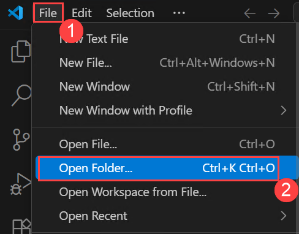
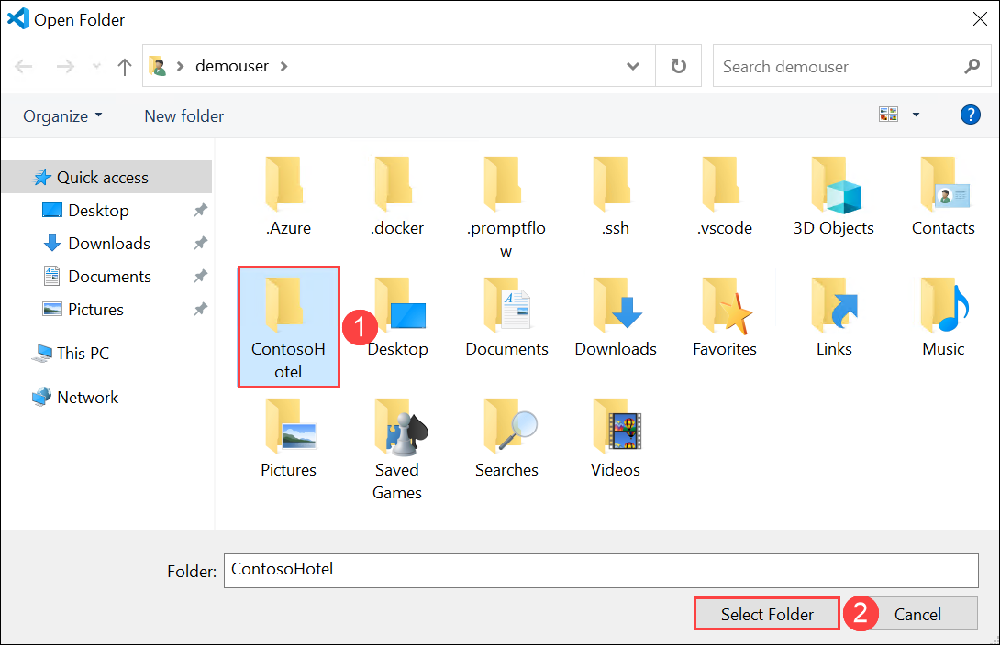
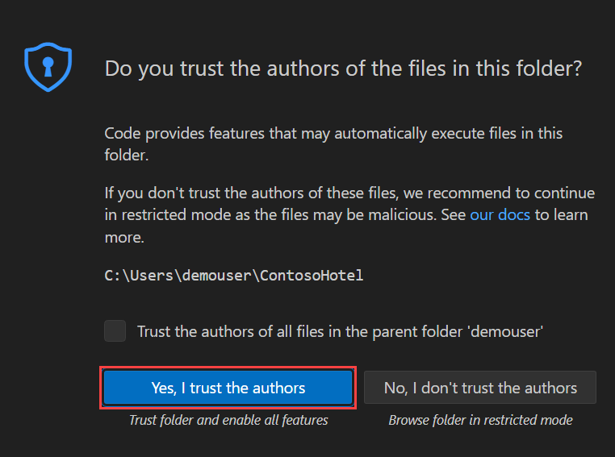
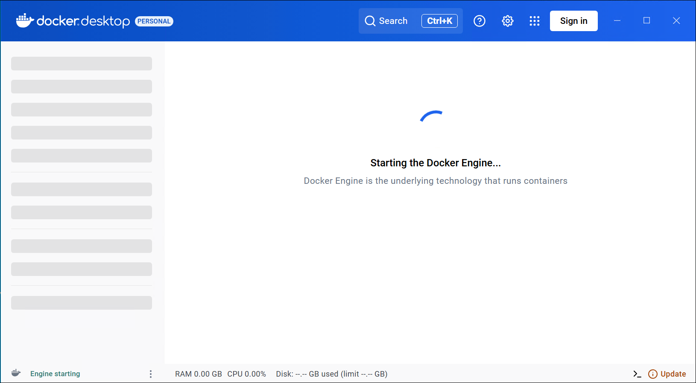
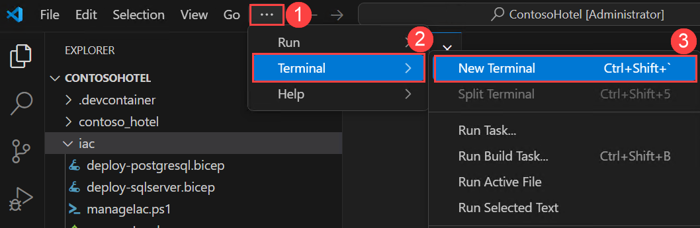
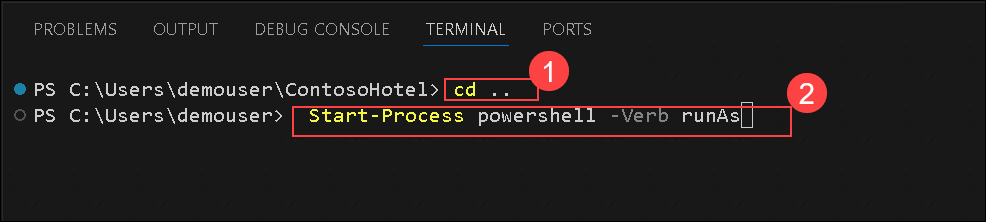
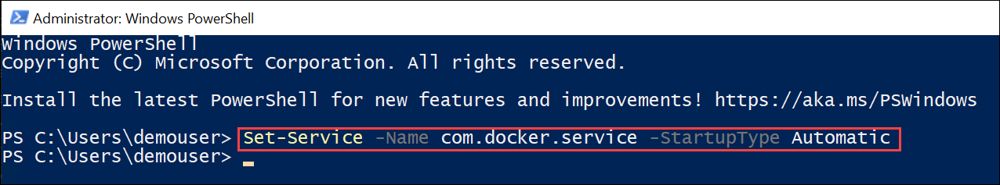
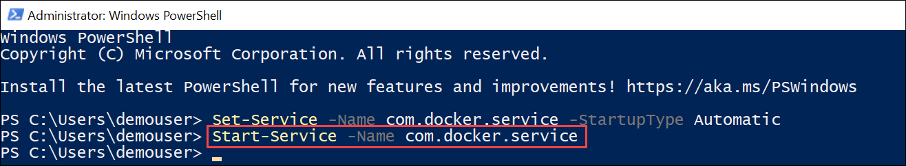
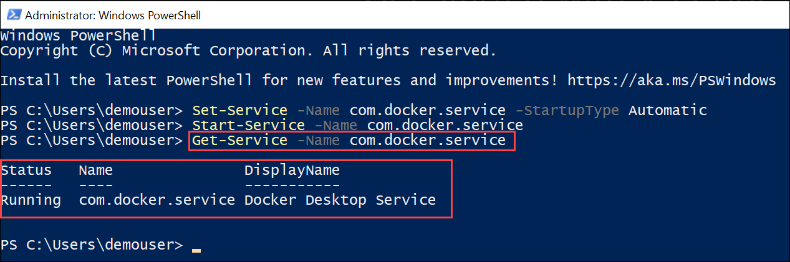

### Note: Please complete this brief survey before proceeding to the next challenge. [Survey Form](https://forms.office.com/r/pPKvR8uz4V)


# Challenge 03: Deploy and Review the Legacy Contoso Hotel App
### Estimated Time: 60 Minutes
## Introduction

The legacy Contoso Hotel app was written using Python code. App components run inside a Docker container. The app can connect to a SQL Server or PostgreSQL database (on-premises or online).

In this challenge, you will deploy a legacy application to a Docker container and run it successfully. The process begins with building a Docker container for the application by creating a Docker image. Next, you will create an Azure Container Registry (ACR) instance to securely store and manage the app’s container image before pushing the image to the registry. To support the application, you will provision a managed PostgreSQL database instance on Azure, ensuring the app has the necessary backend for data storage. Finally, you will run the containerized application, review its functionality, and test it by adding a new booking. This challenge provides hands-on experience with Docker, Azure Container Registry, and PostgreSQL while working on a practical deployment scenario.

Here's a simple overview of each service used by the app:

- **Docker:** Docker is an open-source platform that automates the deployment, scaling, and management of applications. It uses containerization technology to package an application and its dependencies into a container, ensuring that it runs consistently across different environments.
- **Azure Container Registry (ACR):** Azure Container Registry (ACR) is a managed, private Docker registry service provided by Microsoft Azure. It allows you to store and manage container images and artifacts in a secure and scalable manner.
- **PostgreSQL:** PostgreSQL is a powerful, open-source relational database management system (RDBMS). It’s known for its robustness, extensibility, and standards compliance. Azure Database for PostgreSQL Flexible Server is a fully managed database service designed to provide more granular control and flexibility over database management functions and configuration settings.


## Solution Guide

### Task 1: Clone the Repository for This Course

If you have not already cloned the **ContosoHotel** code repository to the environment where you are working on this lab, follow these steps to do so. Otherwise, open the cloned folder in Visual Studio Code.

1. Open **Visual Studio Code** from the Lab VM desktop by double-clicking on it.

   

1. In **Visual Studio Code**, from the top left menu, select the **(...) (1)** ellipses > **Terminal (2)**, then choose **New Terminal (3)**.

   

1. Execute the following command in the terminal to clone the repository to a local folder (it doesn't matter which folder).

   ```
   git clone https://github.com/qxsch/ContosoHotel
   ```
    

1. When the repository has been cloned, open the folder in Visual Studio Code by following these steps:

    - From the top left corner menu, select **File (1)** >  **Open Folder (2)**.

       
      
    - Within the file explorer in **Quick access,** select **ContosoHotel (1),** then click on **Select folder (2)**.

       
      
    - If **Do you trust the authors of the files in this folder?** option is prompted, click on **Yes, I trust the authors**.

         

       > **Note**: If you are prompted to add required assets to build and debug, select **Not Now**.


### Task 2: Build a Docker Container for the App

In this task, you will create the Docker container and add app components to the container.

**Docker** is an open-source platform that automates the deployment, scaling, and management of applications. It uses containerization technology to package an application and its dependencies into a container, ensuring that it runs consistently across different environments.

1. In the lab VM, from the Start bar, search for **Docker (1)** and select **Docker Desktop (2)** from the results.

   

1. Click on **Accept.**

   

1. On the **Finish Setting up Docker Desktop** page, click **Finish**.

   

1. Click **Skip** on the **Welcome to Docker** page. 

   

1. Click on **Skip** on the **Welcome Survey** page.   

   

1. Wait for the app to start. After the app starts, wait for the app to start Docker Engine.

   

1. After the Docker Engine starts, the Docker UI should resemble the following screenshot. Docker will display any running containers.

   

    >**Note**: Minimize the Docker Desktop, but don’t close the app.

1. Navigate back to the Visual Studio Terminal. If closed, from the top left menu, select the **(...) (1)** ellipses > **Terminal (2)**, then choose **New Terminal (3)**.    

   

1. In the terminal, run the below command to navigate back to the root directory **(1)**.

   ```
   cd ..
   ```
1. Enter the following command **(2)** and press **Enter**. This command allows you to run commands as an administrator.

   ```
   Start-Process powershell -Verb runAs
   ```

   

1. Enter the following command in the PowerShell prompt and then press **Enter.** This command configures the Docker daemon to start automatically.

   ```
   Set-Service -Name com.docker.service -StartupType Automatic
   ```
   

1. Enter the following command at the PowerShell prompt and then press Enter. This command manually starts the Docker daemon.

   ```
   Start-Service -Name com.docker.service
   ```
   

1. Enter the following command at the PowerShell prompt and then press Enter. This command checks the status of the Docker daemon. Verify that the results show the Docker daemon is running.

   ```
   Get-Service -Name com.docker.service
   ```
   

1. Minimize the PowerShell window. Return to Visual Studio Code.

1. Enter the below command to navigate back to the **ContosoHotel** folder where the cloned repository resides.

   ```
   cd ContosoHotel
   ```

       

1. From the top left corner menu, select **File (1)** >  **Open File (2)**.

   

1. Select **Dockerfile (1)** and then click on **Open (2)**.

   

1. Replace line 2 with the following.

   ```
   FROM python:3.11-slim-bookworm
   ```

       

1. Save your changes by pressing **Ctrl+S** on your keyboard, or from the top left corner menu, select **File (1)** >  **Save (2)**.  

   

1. Enter the following command at the Terminal window prompt and then press **Enter**. This command builds the container for the app. Wait while the container builds.

   ```
   docker build -t "pycontosohotel:v1.0.0" .
   ```

      

     >**Note:** It may take 2-3 minutes to build the container.

1. Leave Visual Studio Code open. You will use the tool in the next task.     

### Task 3: Create an Azure Container Registry (ACR) Instance and Push the App Container to ACR

In this task, you will create an Azure Container Registry (ACR) instance to store and manage Docker images. You will then push your application’s container image to the registry for secure storage and deployment.

**Azure Container Registry (ACR)** is a managed, private Docker registry service provided by Microsoft Azure. It allows you to store and manage container images and artifacts in a secure and scalable manner.

1. Enter the following command at the Terminal window prompt and then press **Enter**. This command connects the Terminal window with your Azure subscription so that you can deploy Azure resources to the correct subscription.

   ```
   az login
   ```

      

1. Minimize Visual Studio Code.

    - On the "Let’s get you signed in" page, select **Work or School account (1)** and then select **Continue (2)**. 

            

    - Sign in using your Azure credentials.

    - On the **Sign in** page, enter the **Username (1)** and click on **Next (2)**.

           

       >**Note:** You can find the **Username** on the Lab VM's **Environment** page.

    - Enter the **Password (1)** and then click on **Sign in (2)**.  

           

       >**Note:** You can find the **Password** in the Lab VM's **Environment** page.   

    - On the **Automatically sign to all desktop app and websites in this device** page, select **No, this app only.**

               

1. Navigate back to Visual Studio Code. Press **Enter** or **Select a subscription and tenant**.      

   

1. Enter the following command at the Terminal window prompt and then press **Enter**. This command generates a unique name for the ACR instance. Copy and paste the generated name into the notepad for later use.

   ```
   $ACR_NAME = "contosoacr$(Get-Random -Minimum 100000 -Maximum 999999)"
   Write-Host -ForegroundColor Green  "ACR name is: " $ACR_NAME
   ```

      

1. Enter the following command at the Terminal window prompt and then press **Enter**. This command creates an ACR instance.    

   ```
   az acr create --resource-group "Appmod" --name "$ACR_NAME" --sku Basic --admin-enabled true
   ```

      

     >**Note:** Record the ACR name. You will need to supply the ACR name again later in the challenge.

1. Enter the following command at the Terminal window prompt and then press **Enter**. This command signs you into the ACR instance. 

   ```
   az acr login --name "$ACR_NAME"
   ```

      

     >**Note:** You may see an error message stating Azure could not connect to the registry login server. This error usually indicates that even though the container registry instance is provisioned, some configuration is still happening. Wait a few minutes and run the command again.

1. Enter the following command at the Terminal window prompt and then press **Enter**. This command creates a Docker tag for the app.  

   ```
   docker tag "pycontosohotel:v1.0.0" "$ACR_NAME.azurecr.io/pycontosohotel:v1.0.0"
   ```

     

1. Enter the following command at the Terminal window prompt and then press **Enter**. This command pushes the app container to ACR.    

   ```
   docker push "$ACR_NAME.azurecr.io/pycontosohotel:v1.0.0"
   ```

     

     >**Note:** It may take 1-2 minutes to push the app container to ACR.

1. Leave Visual Studio Code open. You will use the tool in the next task.     


### Task 4: Provision a PostgreSQL Database to Support the App

In this task, you will provision a PostgreSQL database to support your application. This involves setting up a managed PostgreSQL instance on Azure to store and manage your app's data.

The Contoso Hotel legacy app stores data in a PostgreSQL database.

**PostgreSQL** is a powerful, open-source relational database management system (RDBMS). It’s known for its robustness, extensibility, and standards compliance. Azure Database for PostgreSQL Flexible Server is a fully managed database service designed to provide more granular control and flexibility over database management functions and configuration settings.

1. Enter the following command at the Visual Studio Code Terminal window prompt. This command connects the Terminal window with your Azure subscription so that you can deploy Azure resources to the correct subscription.

   ```
   Connect-AzAccount
   ```

     

1. Minimize Visual Studio Code.

    - On the Let’s get you signed in page, select **Work or School account (1)** and then select **Continue (2)**. 

            

    - Sign in using your Azure credentials.

    - On the **Sign in** page, enter the **Username (1)** and click on **Next (2)**.

           

       >**Note:** You can find the **Username** on the Lab VM's **Environment** page.

    - Enter the **Password (1)** and then click on **Sign in (2)**.  

           

       >**Note:** You can find the **Password** on the Lab VM's **Environment** page.   

    - On the **Automatically sign to all desktop app and websites in this device** page, select **No, this app only.**

1. Navigate back to Visual Studio Code. You will see that you are already logged in.

   

1. Enter the following command, replace the text `REPLACE_WITH_REGION_YOU_SELECTED_IN_CHALLENGE01_TASK01` with the Azure region location that you have used earlier in Challenge 1, and then press **Enter**. This command deploys a PostgreSQL server instance.

   ```
   .\iac\manageIac.ps1 -iacAction create -passwd "1234ABcd!" -deploy "postgresql" -rgname "Appmod" -location "REPLACE_WITH_REGION_YOU_SELECTED_IN_CHALLENGE1_TASK01"
   ```

     

     >**Note:** The script first checks for common errors and then provisions the database. It may take 6-10 minutes to deploy the PostgreSQL server instance. You may see several warnings displayed during deployment.

1. When the deployment is complete, the Terminal window will display a message in a **green** font showing the database's connection string. **Copy and paste the string into Notepad**.

   

    >**Note:** If you do not see a message after 10 minutes stating that the PostgreSQL server and database are deployed successfully, go to the Azure portal and select your resource group. Look for a PostgreSQL server and database in the list of resources. Check the Overview section of the resource group to see if there are deployments in progress. Notify your coach about any issues.

1. The **POSTGRES_CONNECTION_STRING** should resemble the following. **Copy and paste the connection string obtained in step 5, as you will need it later in the challenge.**

    ```
    host=53pkyjrx5j7ve.postgres.database.azure.com;port=5432;database=pycontosohotel;user=contosoadmin;password=1234ABcd!;
    ```

1. Leave Visual Studio Code open. You will use the tool in the next task.

### Task 5: Run the Containerized App and Add a Booking

In this task, you will run the Docker app container and then display the setup page for the app. You will create the database schema and populate the tables with data. You will review common app pages and add a booking record. Finally, you will search for the record you just added to verify that the record was successfully added to the database.

1. Enter the following command in the Visual Studio Code Terminal window prompt. Replace the `ENTER_CONNECTION_STRING_FROM_CHALLENGE02_TASK04` placeholder text with the **POSTGRES_CONNECTION_STRING** you recorded in the previous task. Then press **Enter**. This command starts the containerized app. Leave the command to run.

   ```
   docker run -p 8000:8000 -e POSTGRES_CONNECTION_STRING="ENTER_CONNECTION_STRING_FROM_CHALLENGE02_TASK04" pycontosohotel:v1.0.0
   ```

     

     >**Note:** You may minimize Visual Studio Code, but don’t close the Visual Studio Code Terminal window at this time.

1. Open a web browser, copy and paste the following URL: `http://localhost:8000/setup`     

1. The **Contoso Hotel Setup** page displays.

   

1. On the Contoso Hotel Setup page, select **Setup database**. This launches a script that creates the database schema and populates the tables with data.   

   

1. The page updates when the script completes.

   

1. On the Contoso Hotel Setup page, select **Home**. The **Home** page for the app displays.   

   

1. On the Home page, select the **calendar** icon to go to the **Bookings** page.   

   

1. On the **Bookings** page, select **New Bookings**.   

   

1. Enter the following information into the page and then select **Add Booking (7)**. The page will update to show you that the booking has been successfully created.   

    - Hotel: **Contoso Suites Athens (1)**

    - Visitor: **Type in the letter `a` into the field and 'double click' on any name that you want to select from the drop-down list (2)**

    - Check-in: **Choose a future date of your preference (3)**

    - Check-out: **Choose a date after the check-in for check-out (4)**

    - Adults: **2 (5)**

    - Rooms: **1 (6)**

      

1. Once the booking is successful, you will see a message like **Successfully created the booking**.

   

1. Copy and paste the visitor's name.   

1. On the **Bookings** page, select **List Bookings**.  

   

1. Enter the visitor's name you selected when adding a booking in the Search field. The booking that you created should appear in the list of bookings.  

   

1. Close the browser window.

1. In Visual Studio Code, select **Ctrl+C** from the Terminal pane to exit the running worker processes.

1. Leave Visual Studio Code open. You will use the tool again in the next challenge.

## Success Criteria:

- Verify that the Docker engine is running.
- You have built a Docker container for the app.
- Created an Azure Container Registry instance.
- You have pushed the app container to ACR.
- You have provisioned an Azure Database for the PostgreSQL Flexible Server instance.
- You can view the app in a web browser.
- You can add a booking record to the app and verify that the record is saved and is searchable.

## Additional Resources:

-  Refer to the  [Introduction to Docker container](https://learn.microsoft.com/en-us/training/modules/intro-to-docker-containers/) for detailed information on the Docker container.
-  [Build a containerized web application with Docker](https://learn.microsoft.com/en-us/training/modules/intro-to-containers/)
-  [Manage container images in Azure Container Registry](https://learn.microsoft.com/en-us/training/modules/publish-container-image-to-azure-container-registry/)
-  [Explore PostgreSQL architecture](https://learn.microsoft.com/en-us/training/modules/explore-postgresql-architecture/)


## Proceed with the next challenge by clicking on **Next**>>.
