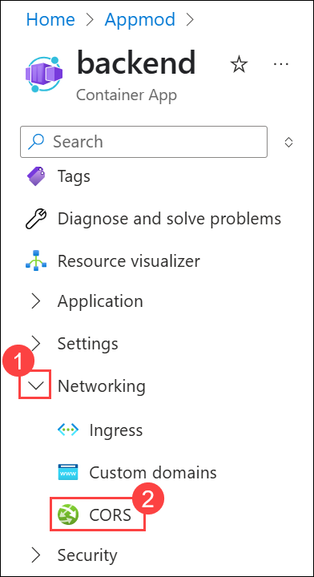

# Challenge 04: Split and Repackage the Contoso Hotel App Components and Deploy the Updated App
### Estimated Time: 60 Minutes
## Introduction

To improve the scalability of the app, Contoso plans to split the frontend components (HTML, CSS, and JavaScript files) from backend components (APIs). In this challenge, you will split the components and refactor some code. Then, you will deploy the frontend and backend components to separate containers. Finally, you will push the containers to ACR and run the updated app.

## Solution Guide

### Task 1: Separate Frontend Components from Backend Components

In this task, you will manually separate frontend and backend components into separate folders.

1. Open Visual Studio Code.

1. From the top left menu, select the **(...) (1)** ellipses > **Terminal (2)**, then choose **New Terminal (3)**.

   

1. Make sure you are in the **ContosoHotel** folder.  

   
  
1. Enter the following command at the Terminal window prompt and press **Enter**. This command creates a directory for frontend components.

   ```
   mkdir -p ContosoHotel/UpdatedApp/Frontend 
   ```

    

1. Enter the following command at the Terminal window prompt and press **Enter**. This command creates a directory for backend components.

   ```
   mkdir -p ContosoHotel/UpdatedApp/Backend
   ```
        

1. From the top left corner menu, select **File (1)** >  **Open Folder (2)**.

   

1. Navigate to `C:\Users\demouser\ContosoHotel\ContosoHotel\UpdatedApp` in the File Explorer and press **Enter**.

   

1. Verify that the subfolders that you have created are present.   

   

1. Enter the following commands at the Terminal window prompt and press **Enter**. These commands will copy all the necessary files to the **Frontend** folder for the updated app.   

   ```
   cp startup.* C:\Users\demouser\ContosoHotel\ContosoHotel\UpdatedApp\Frontend
   cp uwsgi.ini C:\Users\demouser\ContosoHotel\ContosoHotel\UpdatedApp\Frontend
   cp Dockerfile C:\Users\demouser\ContosoHotel\ContosoHotel\UpdatedApp\Frontend
   cp *.docker* C:\Users\demouser\ContosoHotel\ContosoHotel\UpdatedApp\Frontend
   cp requirements.txt C:\Users\demouser\ContosoHotel\ContosoHotel\UpdatedApp\Frontend
   ```

      

1. Click on the **Frontend** drop-down in the Explorer. You will be able to see all the copied files here, appearing under the **Frontend** folder.   

      

1. Enter the following commands at the Terminal window prompt and press **Enter** twice. These commands create a subfolder in the **Frontend** folder and copy all necessary files to the subfolder.    

   ```
   cp -r C:/Users/demouser/ContosoHotel/contoso_hotel/static C:\Users\demouser\ContosoHotel\ContosoHotel\UpdatedApp\Frontend\contoso_hotel\static
   cp -r C:/Users/demouser/ContosoHotel/contoso_hotel/templates C:\Users\demouser\ContosoHotel\ContosoHotel\UpdatedApp\Frontend\contoso_hotel\
   cp C:/Users/demouser/ContosoHotel/contoso_hotel/*.py C:\Users\demouser\ContosoHotel\ContosoHotel\UpdatedApp\Frontend\contoso_hotel\
   ```

       

1. Click on the **contoso_hotel** drop-down under the **Frontend** folder in Explorer. You will be able to see all the copied files.

      

1. This is the complete folder structure of the **Frontend** directory.

      

1. Enter the following commands at the Terminal window prompt and press **Enter** twice. These commands copy all necessary files to the **Backend** folder for the updated app.    

   ```
   cp *.sql C:\Users\demouser\ContosoHotel\ContosoHotel\UpdatedApp\Backend
   cp startup.* C:\Users\demouser\ContosoHotel\ContosoHotel\UpdatedApp\Backend
   cp uwsgi.ini C:\Users\demouser\ContosoHotel\ContosoHotel\UpdatedApp\Backend
   cp *docker* C:\Users\demouser\ContosoHotel\ContosoHotel\UpdatedApp\Backend
   cp requirements.txt C:\Users\demouser\ContosoHotel\ContosoHotel\UpdatedApp\Backend
   ```

        

1. Click on the **Backend** drop-down in the Explorer. You will be able to see all the copied files appearing here under the **Backend** folder.   

          

1. Enter the following commands at the Terminal window prompt and press **Enter** twice. These commands create a subfolder in the **Backend** folder and copy all necessary files to the subfolder.    

   ```
   cp -r C:/Users/demouser/ContosoHotel/contoso_hotel/dblayer C:\Users\demouser\ContosoHotel\ContosoHotel\UpdatedApp\Backend\contoso_hotel\dblayer
   cp C:/Users/demouser/ContosoHotel/contoso_hotel/*.py C:\Users\demouser\ContosoHotel\ContosoHotel\UpdatedApp\Backend\contoso_hotel\
   ```

      

1. Click on the **contoso_hotel** drop-down under the **Backend** folder in Explorer. Check out the copied files.

       

1. This is the complete folder structure of the **Backend** directory.

              

### Task 2: Refactor files

In the previous task, you added a copy of **views.py** to the **Frontend** and **Backend** folders. You added the **Dockerfile** and the **requirements.txt** file to the Frontend folder. In this task, you will modify all three files to remove references to backend functionality. You will also modify the copy of **views.py** in the **Backend** folder to remove references to frontend functionality.

1. In the Explorer pane, expand the **Frontend (1)** folder and then expand the **contoso_hotel (2)** folder.

         

1. Select **views.py**. The file is displayed on the left side of the Visual Studio Code window.    

      

1. Delete all code between the following region markers in the code (at or around lines 9 - 304).

   `#region -------- BACKEND API ENDPOINTS --------`
   
   `#endregion -------- BACKEND API ENDPOINTS --------`

         

1. Locate the line of code that imports dblayer (at or around line 5).   

       

1. Remove **dblayer,**.  

     

     >**Note:** Don’t forget to delete the comma after dblayer.

1. Locate the code that checks to see **if the database is set up** (at or around lines 24-26):  

     

1. Delete the code that performs the database check.

     

1. Save your changes by pressing **Ctrl+S** on your keyboard or from the top left corner menu, select **File** >  **Save,** and then close the file.

1. In the Visual Studio Code Explorer pane, select **Dockerfile**. 

     

1. Locate the code that installs the **MSSQL ODBC driver** (at or around lines 17-23):    

     

1. Delete the code that installs the MSSQL ODBC driver.

     

1. Save your changes by pressing **Ctrl+S** on your keyboard or from the top left corner menu, select **File** >  **Save,** and then close the file.

1. In the Visual Studio Code Explorer pane, select **requirements.txt (1)** and then delete the **pyodbc** and **psycopg2-binary** **(2)** libraries.

     

1. Save your changes by pressing **Ctrl+S** on your keyboard or from the top left corner menu, select **File** >  **Save,** and then close the file.

     

1. In the Explorer pane, expand the **backend (1)** folder and then expand the **contoso_hotel (2)** folder.

     

1. Select **views.py**. Delete all codes between the following region markers in the code for **Frontend API Endpoints** (around lines 312 - 335):   

     

1. Save your changes by pressing **Ctrl+S** on your keyboard or from the top left corner menu, select **File** >  **Save,** and then close the file.

1. Leave Visual Studio Code open. You will run additional commands in the next task.

### Task 3: Build the Containers for Frontend and Backend Components and Push the Containers to Azure

In this task, you will build separate containers for frontend and backend components.

1. Run the below command to get the name of the **Container Registry instance** that you have created in *Challenge 2 Task 3*.

   ```
   az acr list --query "[].{Name:name}" --output table
   ```

      

1. Run the command below, update the following variable, and replace *ACR_NAME_FROM_CHALLENGE02_TASK03* with the name of the instance that you created in Challenge 02 Task 03. The one that you got in the above command.   

   ```
   $ACR_NAME="ACR_NAME_FROM_CHALLENGE2_TASK03"
   ```

      

1. Enter the following commands at the Terminal window prompt and press **Enter** to update the value for the **$PATH_TO_UPDATED_APP** variable to point to the **UpdatedApp** folder.

   ```
   $PATH_TO_UPDATED_APP = "C:\Users\demouser\ContosoHotel\ContosoHotel\UpdatedApp"
   ```

      

1. In Visual Studio Code, enter the following command at the Terminal window prompt and press **Enter**. This command ensures that you are working in the correct folder.

   ```
   cd  $PATH_TO_UPDATED_APP\Frontend
   ```

      

1. Enter the following command at the Terminal window prompt and press **Enter** after the last command. This command builds the container for the frontend app components.

   >**Note:** Before running the command, ensure that Docker is running.

   ```
   docker pull python:slim-bookworm
   docker build -t "pycontosohotel-frontend:v1.0.0" .
   ```

      

     >**Note:** It may take 2-3 minutes to build the Docker container.

1. Enter the following command at the Terminal window prompt and then press **Enter**. This command signs you into the ACR instance. 

   ```
   az acr login --name "$ACR_NAME"
   ```

           

1. Enter the following commands at the Terminal window prompt and press **Enter**. These commands tag the frontend container and push the container to ACR.  

   ```
   docker tag "pycontosohotel-frontend:v1.0.0" "$ACR_NAME.azurecr.io/pycontosohotel-frontend:v1.0.0"
   docker push "$ACR_NAME.azurecr.io/pycontosohotel-frontend:v1.0.0"
   ```

      

1. Enter the following commands at the Terminal window prompt and press **Enter** twice. These commands switch the context to the Backend folder and then build the Docker container for the backend app components.    

   ```
   cd  $PATH_TO_UPDATED_APP\Backend
   docker pull python:slim-bookworm
   docker build -t "pycontosohotel-backend:v1.0.0" .
   ```

    >**Note:** It may take 2-3 minutes to build the Docker container.

1. Enter the following commands at the Terminal window prompt and press **Enter**. These commands tag the backend container and push the container to ACR.

   ```
   docker tag "pycontosohotel-backend:v1.0.0" "$ACR_NAME.azurecr.io/pycontosohotel-backend:v1.0.0"
   docker push "$ACR_NAME.azurecr.io/pycontosohotel-backend:v1.0.0"
   ```

     

1. Enter the following commands at the Terminal window prompt and press **Enter**. These commands register app providers.    

   ```
   az provider register --namespace Microsoft.App
   az provider register --namespace Microsoft.OperationalInsights
   ```

     

     >**Note:** It may take 2-3 minutes for these commands to complete.

1. Update the value of the **AZURE_REGION_FROM_CHALLENGE1_TASK01** variable to use the region that you selected in Challenge 01 Task 01. Then, enter the command at the Terminal window prompt and then press **Enter**.   

   ```
   $AZURE_REGION="AZURE_REGION_FROM_CHALLENGE01_TASK01"
   ```

     

1. Enter the following commands at the Terminal window prompt and press **Enter** after the last command. These commands create the container app environment.

   ```
   $CONTOSO_HOTEL_ENV = "contosoenv$(Get-Random -Minimum 100000 -Maximum 999999)"
   $CONTOSO_ACR_CREDENTIAL = az acr credential show --name $ACR_NAME --query "passwords[0].value" -o tsv
   az containerapp env create --name "$CONTOSO_HOTEL_ENV" --resource-group "Appmod" --location "$AZURE_REGION"
   Write-Host -ForegroundColor Green  "Default Domain is: $(az containerapp env show --name "$CONTOSO_HOTEL_ENV" --resource-group "Appmod" --query "properties.defaultDomain" -o tsv)"
   ```

     

     >**Note:** It may take 2-3 minutes for these commands to complete.

1. Replace the **ENTER_CONNECTION_STRING_FROM_CHALLENGE03_TASK04** placeholder text in the following command with the connection string you recorded in *Challenge 03 Task 04*. Enter the command at the Visual Studio Code Terminal window prompt and then select **Enter** after the last command. These commands create the container app for the backend app components.

   ```
   az containerapp create --name "backend" --resource-group "Appmod" --environment "$CONTOSO_HOTEL_ENV" --image "$ACR_NAME.azurecr.io/pycontosohotel-backend:v1.0.0" --target-port 8000 --ingress external --transport http --registry-server "$ACR_NAME.azurecr.io" --registry-username "$ACR_NAME" --registry-password "$CONTOSO_ACR_CREDENTIAL" --env-vars POSTGRES_CONNECTION_STRING="ENTER_CONNECTION_STRING_FROM_CHALLENGE03_TASK04"
   $CONTOSO_BACKEND_URL = "https://$(az containerapp show --name "backend" --resource-group "Appmod" --query 'properties.configuration.ingress.fqdn' -o tsv)"
   Write-Host -ForegroundColor Green  "Backend URL is: $CONTOSO_BACKEND_URL"
   ```

     

1. Enter the following commands at the Terminal window prompt and press **Enter** after the last command. These commands create the **container app** for the **frontend** app components.

   ```
   az containerapp create --name "frontend" --resource-group "Appmod" --environment "$CONTOSO_HOTEL_ENV" --image "$ACR_NAME.azurecr.io/pycontosohotel-frontend:v1.0.0" --target-port 8000 --ingress external --transport http --registry-server "$ACR_NAME.azurecr.io" --registry-username "$ACR_NAME" --registry-password "$CONTOSO_ACR_CREDENTIAL" --env-vars "API_BASEURL=$CONTOSO_BACKEND_URL"
   $CONTOSO_FRONTEND_URL = "https://$(az containerapp show --name "frontend" --resource-group "Appmod" --query 'properties.configuration.ingress.fqdn' -o tsv)"
   Write-Host -ForegroundColor Green  "Frontend URL is: $CONTOSO_FRONTEND_URL"
   ```

     

     >**Note:** Record the value for the frontend URL. You will use the value later in the next steps.

1. Navigate to the Azure portal. If not signed in, sign in with the credentials given in the **Environment** tab.

1. In the top search bar, search for **Resource groups (1)** and select **Resource groups (2)** from the services.

     

1. Select the **Appmod** resource group.

     

1. Select the **backend** container app.    

     

1. In the left navigation pane for the container app, in the **Networking (1)** section, select **CORS (2)**.    

     

1. In the **Allowed Origins (1)** field, enter the value for the frontend URL that you recorded in Step 14 of this task, and then navigate to the **Allowed Methods (2)** field.   

     

1. Enter an asterisk `***` **(1)** and select **Apply (2)** to create the CORS policy.  

     

1. Leave Visual Studio Code open. You will run additional commands in the next challenge.

## Success Criteria:

- You have created the UpdatedApp folder and the Frontend and Backend subfolders.
- You have copied the required files to the Frontend and Backend subfolders.
- You have updated the views.py, Dockerfile, and requirements.txt files in the Frontend folder and removed backend code and references to data libraries.
- You have updated the views.py in the Backend folder and removed the frontend code.
- You have created Docker containers for frontend and backend application components.
- You have created an ACR environment and container apps.
- You have configured CORS policies.

## Additional Resources:

-  [Decompose a monolithic application](https://learn.microsoft.com/en-us/training/modules/microservices-architecture/)

-  [az containerapp create](https://learn.microsoft.com/en-us/cli/azure/containerapp?view=azure-cli-latest#az-containerapp-create)

## Proceed with the next challenge by clicking on **Next**>>.
