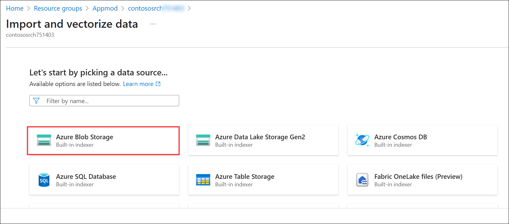
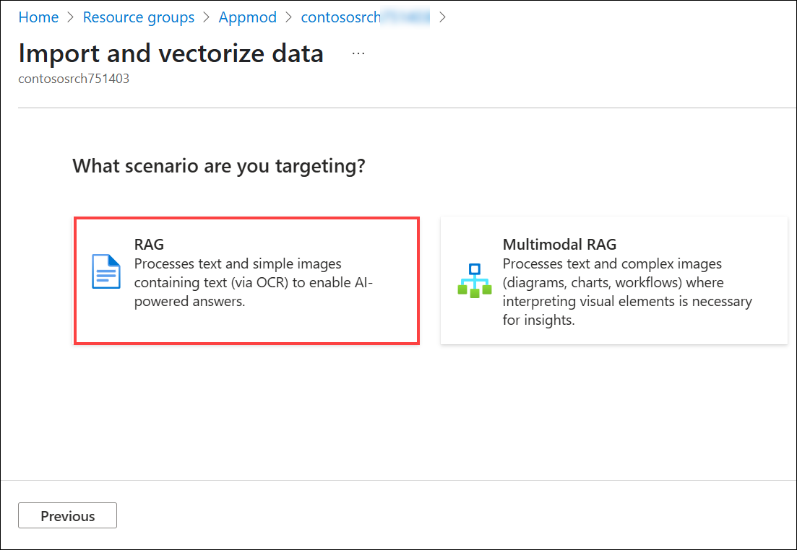

# Challenge 05: Set up Azure Resources and Extract Data from Hotel Brochures
### Estimated Time: 45 Minutes
## Introduction
When people make travel plans, they often select a hotel based on the location of the hotel or the amenities that the hotel offers. Most hotel websites make it easy to search their hotels by date and location. However, it can be challenging to narrow down the list so that only hotels with specific amenities display.

Contoso wants to build a chatbot that helps potential guests find a hotel that meets their needs. For this solution, you will upload PDF versions of the Contoso Hotel brochures to an Azure Storage account. Then, you will use the Azure Search service and Azure OpenAI service to scan the PDFs and extract information that a chatbot can use to respond to guest inquiries.

Here's a simple overview of each service used:

- **Azure Blob Storage:** Azure Blob Storage contains brochures for hotels. Storing the brochures in Azure Blob Storage ensures that the brochures are available for searching by Azure AI Search Service.

- **Azure AI services:** Azure AI services are a set of cloud-based APIs you can use in AI applications and data flows.

- **Azure AI Search:** Azure AI Search includes a wizard that allows you to import and vectorize data. You will use the wizard to extract and vectorize data from the hotel brochures.
        
### Task 1: Create Azure services

In this task, you will create an Azure Blob Storage account and then upload PDF files to the storage account. Each PDF file is a brochure for one of the hotels represented in the Contoso Hotels app. Then, you will provision an Azure Search Service instance. Finally, you will provision an Azure OpenAI service instance and deploy models to the instance.


1. In Visual Studio Code, enter the following commands at the Terminal window prompt and press **Enter** after the last command. These commands create a **storage account** and a **storage container**.

   ```
   $CONTOSO_STORAGE_ACCOUNT_NAME="contososa$(Get-Random -Minimum 100000 -Maximum 999999)"
   az storage account create --name $CONTOSO_STORAGE_ACCOUNT_NAME --resource-group ODL-app-hack-xxxxxxx-Appmod --location $AZURE_REGION --sku Standard_LRS
   az storage container create --name brochures --account-name $CONTOSO_STORAGE_ACCOUNT_NAME
   ```

    

1. On the Azure home page, select **Resource groups** and then select **ODL-app-hack-xxxxxxx-Appmod**. 

1.  Locate the row for the created **Storage account.** *Copy and paste the **Storage account** name into Notepad*. You will need the name in an upcoming task.

    

1. Navigate to Visual Studio Code, enter the following command at the Terminal window prompt, and press **Enter**. This command clones assets for this workshop, including hotel brochures from a GitHub repository, to a folder named **AssetsRepo**.

   ```
   git clone https://github.com/microsoft/TechExcel-Modernize-applications-to-be-AI-ready.git "C:/Users/demouser/AssetsRepo"
   ```

    

1. Enter the following command at the Terminal window prompt and press **Enter**. This command uploads the brochures to the storage container you created earlier in this task.   

   ```
   az storage blob upload-batch --account-name $CONTOSO_STORAGE_ACCOUNT_NAME --destination brochures --source "C:\Users\demouser\AssetsRepo\Assets\PDFs" --pattern "*.pdf" --overwrite
   ```

    

1. Enter the following commands at the Terminal window prompt and press **Enter**. These commands create the **Azure Search Service instance**.

   ```
   $CONTOSO_SEARCH_SERVICE_NAME="contososrch$(Get-Random -Minimum 100000 -Maximum 999999)"
   az search service create --name $CONTOSO_SEARCH_SERVICE_NAME --resource-group ODL-app-hack-xxxxxxx-Appmod --sku Basic --location $AZURE_REGION  --auth-options aadOrApiKey --aad-auth-failure-mode http403 --identity-type SystemAssigned
   ```

       

     >**Note:** It may take 10-15 minutes for provisioning to complete.

1. On the Azure home page, select **Resource groups** and then select **ODL-app-hack-xxxxxxx-Appmod**. 

1. Copy and paste the name of the **Search Service instance** you created previously into Notepad from the list of resources. You will need the name in an upcoming task.

    


### Task 2: Configure Managed Identities for Deployed Azure Resources

In this task, you will create a set of managed identities so that the various Azure resources you created can communicate with each other.

1. On the Azure home page, select **Resource groups** and then select **ODL-app-hack-xxxxxxx-Appmod**.

1. In the list of services, select the **Azure AI Search instance** you created.

    

1. From the left navigation pane, under the **Settings (1)** section, select **Identity (2)**. Verify that the value for the Status field on the System Assigned tab is **On (3)**.    

    

1. If prompted, select **Yes** to confirm the change.

1. On the Azure home page, select **Resource groups** and then select **ODL-app-hack-xxxxxxx-Appmod**.

1. In the list of services, select the **Azure OpenAI resource** you created.

    

1. From the left navigation pane, under the **Resource Management (1)** section, select **Identity (2)**. Set the value for the Status field on the System Assigned tab to **On (3)** and then click **Save (4)**. 

    

1. If prompted, select **Yes** to confirm the change.

    

1. Navigate back to the Visual Studio Code Terminal.

1. Modify the values for the variables to reflect the names of the resources you created in previous challenges and tasks, and then press **Enter**.

   ```
   $CONTOSO_SEARCH_SERVICE_NAME="ENTER_SEARCH_ SERVICE_NAME_YOU_RECORDED_TASK01_STEP08"
   $CONTOSO_STORAGE_ACCOUNT_NAME="ENTER_STORAGE_ACCOUNT_NAME_YOU_RECORDED_TASK01_STEP03"
   $CONTOSO_OPENAI_NAME="ENTER_OPENAI_NAME_YOU_RECORDED_CHALLENGE01_TASK01"
   ```

    

1. Enter the following commands at the Terminal window prompt and press **Enter** after the last command. These commands allow *Azure Search and Azure OpenAI instances to access the Azure Blob Storage account.*    

   ```
   $SEARCH_IDENTITY=$(az search service show --name $CONTOSO_SEARCH_SERVICE_NAME --resource-group ODL-app-hack-xxxxxxx-Appmod --query identity.principalId -o tsv)
   $AI_IDENTITY=$(az cognitiveservices account identity show --name $CONTOSO_OPENAI_NAME --resource-group ODL-app-hack-xxxxxxx-Appmod --query principalId -o tsv)
   $STORAGE_SCOPE=$(az storage account show --name $CONTOSO_STORAGE_ACCOUNT_NAME --resource-group ODL-app-hack-xxxxxxx-Appmod --query id -o tsv)
   az role assignment create --role "Storage Blob Data Contributor" --assignee $SEARCH_IDENTITY --scope $STORAGE_SCOPE
   az role assignment create --role "Storage Blob Data Contributor" --assignee $AI_IDENTITY --scope $STORAGE_SCOPE
   ```

    

1. Enter the following commands at the Terminal window prompt and press **Enter** after the last command. These commands allow *Azure Search to access the Azure OpenAI Service instance you created*.

   ```
   $AI_SCOPE=$(az cognitiveservices account show --name $CONTOSO_OPENAI_NAME --resource-group ODL-app-hack-xxxxxxx-Appmod --query id -o tsv)
   az role assignment create --role "Cognitive Services OpenAI Contributor" --assignee $SEARCH_IDENTITY --scope $AI_SCOPE
   ```

    

1. Enter the following commands at the Terminal window prompt and press **Enter** after the last command. These commands allow the *Azure OpenAI Service instance to access the Azure Search Service instance you created*.    

   ```
   $SEARCH_SCOPE=$(az search service show --name $CONTOSO_SEARCH_SERVICE_NAME --resource-group ODL-app-hack-xxxxxxx-Appmod --query id -o tsv)
   az role assignment create --role "Search Index Data Contributor" --assignee $AI_IDENTITY --scope $SEARCH_SCOPE
   az role assignment create --role "Search Index Data Reader" --assignee $AI_IDENTITY --scope $SEARCH_SCOPE
   az role assignment create --role "Search Service Contributor" --assignee $AI_IDENTITY --scope $SEARCH_SCOPE
   ```

    

1. Leave Visual Studio Code open. You will run additional commands in the next task.    

### Task 3: Configure Azure AI Search to Extract Data from the Brochures and Test the Search Index

In this task, you will use Azure AI Search to import and vectorize data from the hotel brochures. You will then test the index.

1. Navigate to the **Azure portal**.

1. On the Azure home page, select **Resource groups** and then select **ODL-app-hack-xxxxxxx-Appmod**.

1. In the list of resources that displays, select the **Azure AI Search service instance** from the list of resources.

    

1. On the Overview page for the Search service, select **Import and vectorize data**.    

    

1. On the **Lets start by picking a data source..** page, select **Azure Blob Storage**.    

    

1. On the **What scenario are you targeting?** page, select **RAG**. 

    

1. On the **Configure your Azure Blob Storage** page, enter the following information and then select **Next (3)**. Wait while Azure validates the connection:    

    - **Storage account:** Select the storage account you created in Challenge 04, Task 01, Step 03. **(1)**

    - **Blob container:** **brochures (2)**

         

1. On the **Vectorize your text** page, enter the following information:  

    - Kind: **Azure OpenAI (1)**
    - Azure OpenAI service: Select **the name you recorded in Challenge 01 step Task 1 (2)**
    - Model deployment: **text-ada-002 (3)**
    - Authentication type: **System assigned identity (4)**
    - Select the checkbox to acknowledge that connecting to the Azure OpenAI service will incur costs **(5),** then select **Next (6)**.

            

1. Select **Next** again to skip the **Vectorize and enrich your images** step.    

1. On the **Advanced settings** page, select **Enable semantic ranker (1)**. In the Schedule indexing drop-down list, select **Once (2)** and then click on **Next (3)**.

         

1. On the **Review and create** page, enter **brochures-vector (1)** in the Objects name prefix text field and then select **Create (2)**. 

      

1. Wait for the creation process to complete and select **Close**.  

      

     >**Note:** It should take only a few minutes for the Import and vectorize data tool to index the data from the 40 hotel brochures.

1. In the left navigation pane for the Search Service instance, under the **Search management** section, choose **Indexers**. You can see the indexer, and the status for the indexer should be **Succeeded**.

      

     >**Note:** The Status for the indexer should be Succeeded. If the Status indicates that indexing is still in progress, wait a few minutes and refresh the page.

1. In the left navigation pane for the Search Service instance, under the **Search management** section, choose **Indexes (1)** and then select Index **(2)**.

      

1. In the search field, enter **Skiing (1)** and select **Search (2)**. Review the output from the search operation. The results should list data about **skiing** and should also contain a text vector.

      

1. Leave Visual Studio Code open. You will run additional commands in the next challenge.  
  
## Success Criteria:

- You have uploaded the hotel brochures to the container in the Azure Storage account.
- You have created an Azure AI Search Service instance.
- You have configured managed identities so that the Azure Blob Storage account, Azure AI Search instance, and Azure OpenAI Service instance can communicate with each other.
- You have successfully completed all steps in the Import and Vectorize data wizard.
- You have deployed models to an Azure OpenAI instance.
- You have tested the search index by using Search Explorer and can view results.

## Additional Resources:

- Refer to the [Implement managed identities](https://learn.microsoft.com/en-us/training/modules/implement-managed-identities/) to learn how managed identities can help you deploy secure solutions on Azure without the need to manage credentials.
- Refer to the [Azure Search Overview](https://learn.microsoft.com/en-us/azure/search/search-what-is-azure-search) to get additional information about Azure Search.

## Proceed with the next challenge by clicking on **Next**>>.
