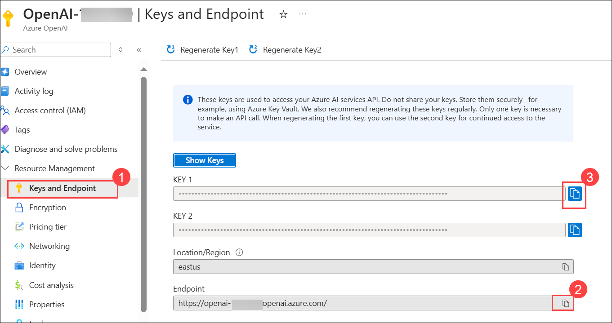
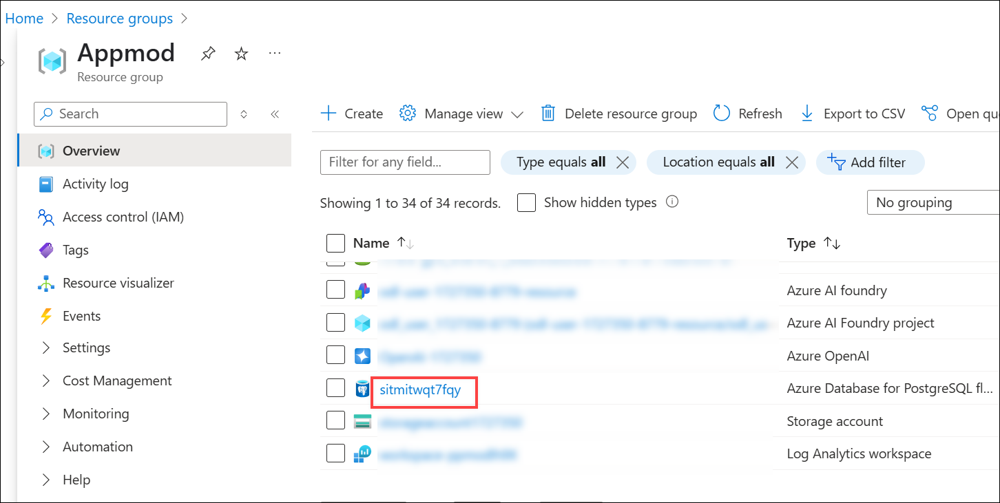
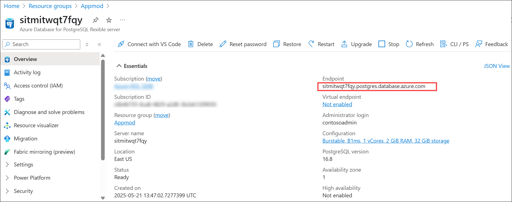

# Challenge 07: Integrate the Chatbot with the Contoso Hotel Application
### Estimated Time: 30 Minutes
## Introduction

At this point, you have a chatbot that can query the hotel brochures. In this challenge, you will integrate the chatbot into the updated Contoso Hotel application.

### Task 1: Set up Visual Studio Code and Run the Flow Locally

In this task, you will test the chatbot locally before you publish the chatbot.

1. Open **File Explorer** from the bottom menu.

   

1. Navigate to the `C:\Users\demouser\AssetsRepo\Assets` folder and press **Enter**.

   

1. Right-click on **lab-6-promptflow.zip (1)**. Select **Extract all (2)**.

   

1. Select **Extract**.

   

1. Launch Visual Studio Code as an **administrator** from the desktop.

   

1. From the menu bar, select **File (1)** and then select **Open Folder (2)**.  

   

1. Navigate into `C:\Users\demouser\AssetsRepo\Assets`. Select **lab-6-promptflow (1)** folder, and then select **Select folder (2).**

   

1. If prompted, **Do you trust the authors of the files in this folder?** option, click on **Yes, I trust the authors**.

     

1. In the **Explorer pane**, expand **lab-6-promptflow (1)**. Right-click **.env.sample (2)** and select **Rename (3)**. 

     

1. Rename the file to `.env`. 

1. Select **.env** to open the file in an Editor window.

     

1. Update the variables to use the same values that you used in Challenge 05, Task 01. Do not copy and paste this directly into the `.env` file; instead, manually update the values within the file as needed.

   ```
   AZURE_OPENAI_ENDPOINT="https://openai-xxxxxx.openai.azure.com/"
   AZURE_OPENAI_API_KEY="xxxxxxxxxxxxxxxxxxx"
   AZURE_OPENAI_DEPLOYMENT_ID="gpt-4o"
   AZURE_AI_SEARCH_ENDPOINT="https://contososrchxxxxxx.search.windows.net"
   AZURE_AI_SEARCH_INDEX="brochures-vector"
   AZURE_AI_SEARCH_API_KEY="xxxxxxxxxxxxxxxxx"
   PGHOST="xxxxxxxxxx.postgres.database.azure.com"
   PGPORT="5432"
   PGUSER="promptflow"
   PGDATABASE="pycontosohotel"
   PGPASSWORD="1234ABCD!"
   ```
    - To locate the values for **AZURE_OPENAI_ENDPOINT** and **AZURE_OPENAI_API_KEY**, in the Azure portal, select the Azure OpenAI resource you created. In the **Resource Management** section, select **Keys and Endpoints (1)**. Use the **Endpoint** URL for AZURE_OPENAI_ENDPOINT **(2)** and the **key 1** value for AZURE_OPENAI_API_KEY **(3)**.

        

    - To locate the values for **AZURE_AI_SEARCH_ENDPOINT**, **AZURE_AI_SEARCH_INDEX**, and **AZURE_AI_SEARCH_API_KEY**, in the Azure portal, select the Search Service instance you created. On the Overview page, use the **URL** for AZURE_AI_SEARCH_ENDPOINT.    

         

    - In the left navigation pane, in the Search Management section, select **Indexes**. Use the index name for **AZURE_AI_SEARCH_INDEX**.      

      

    - In the left navigation pane, in the Settings section, select **Keys (1)**. Use the **Primary admin key** for AZURE_AI_SEARCH_API_KEY **(2)**.                  

         
    
    - To locate the value for **PGHOST**, navigate to PostgreSQL, and use the **Endpoint** for **PGHOST.**

       
       

    - PGPORT=**5432**
    - PGUSER=**promptflow**
    - PGDATABASE=**pycontosohotel**
    - PGPASSWORD=**1234ABCD!**     

1. Save your changes to the **.env** file by pressing **Ctrl+S** on your keyboard.

     

1. Open a new Terminal prompt by selecting **Terminal** from the top menu and then **New Terminal**.   

1. Enter the following commands and press **Enter** to create environment variables.

   ```
   get-content .env | foreach {
   $name, $value = $_.split('=')
   set-content env:\$name $value
   }
   ```

    

1. Enter the following commands in the Terminal and press **Enter** after the last command to create a connection to Azure Open AI.

   ```
   pf connection create --file azure_openai.yaml --name azure_openai --set "api_base=$env:AZURE_OPENAI_ENDPOINT" --set "api_key=$env:AZURE_OPENAI_API_KEY"
   pf connection create --file azure_ai_search.yaml --name azure_ai_search --set "api_base=$env:AZURE_AI_SEARCH_ENDPOINT" --set "api_key=$env:AZURE_AI_SEARCH_API_KEY"
   pf connection create --file postgresql.yaml --name postgresql --set "configs.hostname=$env:PGHOST" --set "configs.port=$env:PGPORT" --set "configs.user=$env:PGUSER" --set "configs.database=$env:PGDATABASE" --set "secrets.passwd=$env:PGPASSWORD"
   ```

    

1. Enter the following command at the Terminal window prompt and press **Enter**. This command lists all connections.     

   ```
   pf connection list | ConvertFrom-Json | Select-Object name, type |Format-Table
   ```

      

1. Enter the following command at the Terminal window prompt and press **Enter**. This command installs all dependencies listed in the **requirements.txt** file. 

   ```
   pip install -r requirements.txt
   ```

     

1. Enter the following commands at the Terminal window prompt and press **Enter**. These commands run the flow interactively so that you can perform testing.

   ```
   pf flow test --flow . --interactive
   ```

1. Try `Where can I ski?` at the **User:** prompt.

     

     

1. Try `How many free rooms do hotels in Switzerland have grouped by hotel on 2024-10-10?` at the **User:** prompt.

     

     

   >**Note:** If the bot prompts with "Could you please confirm if we should use the getroomsusagewithintimespan function for this query", enter **yes**. 

1. Now, to exit the chat terminal, press **Ctrl + C**.

1. If you encounter this error, **Error: “pf.flow.test failed with UserErrorException: TypeError: Execution failure in ‘chat_with_data’**.

    - The installed **OpenAI** Python package may be incompatible with the script and throw the error shown. 
    - In the terminal, you can check its version using `pip show openai`.
    - Downgrade the package by using `pip install openai==1.58.1`.
    
1. Run the interactive flow again:    

   ```
   pf flow test --flow . --interactive
   ```

### Task 2: Deploy the Flow to Azure Container Apps and Test the App

In this task, you will prepare the flow for deployment and deploy the flow. You will update the app to display the chatbot page.

1. Navigate back to Visual Studio Code.

1. Run the following command to get the name of the **Container Registry instance** that you have created in *Challenge 3 Task 3*.

   ```
   az acr list --query "[].{Name:name}" --output table
   ```

1. Enter the following command and press **Enter**. Update the following variable; replace *ACR_NAME_FROM_CHALLENGE03_TASK03* with the name of the instance that you recorded in Challenge 03 Task 03. The one that you got in the above command.   

   ```
   $ACR_NAME="ACR_NAME_FROM_CHALLENGE3_TASK03"
   ```

     

1. Enter the following command at the Terminal window prompt and sign in.  

   ```
   az login
   ```

1. Minimize Visual Studio Code.

    - On the Let’s get you signed in page, select **Work or School account (1)** and then select **Continue (2)**. 

            

    - Sign in using your Azure credentials.

    - On the **Sign in** page, enter the **Username (1)** and click on **Next (2)**.

           

       >**Note:** You can find the **Username** on the Lab VM's **Environment** page.

    - Enter the **Password (1)** and then click on **Sign in (2)**.  

           

       >**Note:** You can find the **Password** on the Lab VM's **Environment** page.   

    - If prompted, on the **Automatically sign in to all desktop apps and websites on this device?** page, select **No, this app only.**

1. Navigate to Visual Studio Code, press **Enter** to **select a subscription and tenant**.      

   

1. Enter the following commands in the Visual Studio Code Terminal window prompt and press **Enter**. These commands containerize the flow and push the flow to ACR.   

   ```
   # login to acr
   az acr login --name "$ACR_NAME"
   # create flow
   pf flow build --source . --output docker-dist --format docker
   # copy the azure_openai.yaml, azure_ai_search.yaml, and postgresql.yaml into the connections folder
   Copy-Item -Path .\azure_openai.yaml -Destination .\docker-dist\connections -Force
   Copy-Item -Path .\azure_ai_search.yaml -Destination .\docker-dist\connections -Force
   Copy-Item -Path .\postgresql.yaml -Destination .\docker-dist\connections -Force
   # build container
   docker build -t "$ACR_NAME.azurecr.io/chatbot:v1.0.0" ./docker-dist
   # push it to acr
   docker push "$ACR_NAME.azurecr.io/chatbot:v1.0.0"
   # have an overview of defined environment variables
   Get-ChildItem -Path '.\docker-dist\connections' -Filter '*.yaml' | Get-Content | Select-String 'env:'
   # clean up
   Remove-Item -Recurse -Force ./docker-dist
   ```

       

    >**Note:** This command will take around 5 minutes to run completely.

1. Configure and update the following variables based on your previous configurations and select **Enter**.  `$CONTOSO_HOTEL_ENV` will be the name of your Container Apps Environment found in the **ODL-app-hack-xxxxxxx-Appmod** Resource Group. The **_API_KEY**, **_ENDPOINT**, and **PGHOST** variable values can be found in the `.env` file from the last task.      

   ```
   $CONTOSO_HOTEL_ENV = "contosoenvxxxxx"
   $AZURE_OPENAI_ENDPOINT = "https://openai-xxxxxxx.openai.azure.com/"
   $AZURE_OPENAI_API_KEY = "xxxxxxxxxxxxxxx"
   $AZURE_AI_SEARCH_ENDPOINT = "https://contososrchxxxxx.search.windows.net"
   $AZURE_AI_SEARCH_API_KEY = "xxxxxxxxxxxxx"
   $PGHOST = "xxxxxxx.postgres.database.azure.com"
   ```

      

    - `$CONTOSO_HOTEL_ENV` will be the name of your Container Apps Environment found in the **ODL-app-hack-xxxxxxx-Appmod** Resource Group.

           

1. Enter the following to set the variables for values we have used previously and press **Enter** after the last command.        

   ```
   $RG_NAME = "ODL-app-hack-xxxxxxx-Appmod"
   $CONTOSO_ACR_CREDENTIAL = az acr credential show --name $ACR_NAME --query "passwords[0].value" -o tsv
   $PGUSER = "promptflow"
   $PGPASSWORD = "1234ABCD!"
   $PGDATABASE = "pycontosohotel"
   $PGPORT = "5432"
   ```

         

1. Enter the following commands in the Terminal to deploy the container to ACR and set environment variables.

   ```
   az containerapp create --name "chatbot" --resource-group "$RG_NAME" --environment "$CONTOSO_HOTEL_ENV" `
   --image "$ACR_NAME.azurecr.io/chatbot:v1.0.0" --target-port 8080 --transport http `
   --registry-server "$ACR_NAME.azurecr.io" --registry-username "$ACR_NAME" --registry-password "$CONTOSO_ACR_CREDENTIAL" `
   --secrets "searchkey=$AZURE_AI_SEARCH_API_KEY" "openaikey=$AZURE_OPENAI_API_KEY" "pgpassword=$PGPASSWORD" `
   --env-vars "AZURE_AI_SEARCH_ENDPOINT=$AZURE_AI_SEARCH_ENDPOINT" "AZURE_AI_SEARCH_API_KEY=secretref:searchkey" `
   "AZURE_OPENAI_ENDPOINT=$AZURE_OPENAI_ENDPOINT" "AZURE_OPENAI_API_KEY=secretref:openaikey" `
   "PGHOST=$PGHOST" "PGPORT=$PGPORT" "PGUSER=$PGUSER" "PGDATABASE=$PGDATABASE" "PGPASSWORD=secretref:pgpassword" --ingress external
   $CONTOSO_CHATBOT_URL = "https://$(az containerapp show --name "chatbot" --resource-group "$RG_NAME" --query 'properties.configuration.ingress.fqdn' -o tsv)"
   Write-Host -ForegroundColor Green  "Promptflow URL is: $CONTOSO_CHATBOT_URL"
   ```

         

    >**Note:** Please copy and paste the **Prompflow URL** on a notepad.   

1. You can also see the newly created **Chatbot** in the **ODL-app-hack-xxxxxxx-Appmod** resource group.

     

1. Please copy and paste the **Application URL** into a notepad. This is the same as the one that you have copied in 10.     

     

1. Enter the following to pull and set the **$CONTOSO_BACKEND_URL** variable for use in the next step.   

   ```
   $CONTOSO_BACKEND_URL = "https://$(az containerapp show --name "backend" --resource-group "ODL-app-hack-xxxxxxx-Appmod" --query 'properties.configuration.ingress.fqdn' -o tsv)"
   ```

            

1. Enter the following commands in the Visual Studio Code Terminal window prompt and press **Enter** after the last command. These commands update the application frontend. 

   ```
   az containerapp update --name "frontend" --resource-group "$RG_NAME" --set-env-vars "CHATBOT_BASEURL=$CONTOSO_BACKEND_URL"
   az containerapp update --name "backend" --resource-group "$RG_NAME" --set-env-vars "CHATBOT_BASEURL=$CONTOSO_CHATBOT_URL"
   ```

1. Make sure you were able to deploy and update the values successfully.

1. Open a new browser tab and paste the **Application URL** that you copied in step 12.

1. Enter the query `Where can I ski?` in the question box and then **send**. You can see the results.

     

1. Enter the query `How many free rooms do hotels in Switzerland have grouped by hotel on 2024-10-10?` in the question box and then **send**. You can see the results.    

     

   >**Note:** If the bot responds with **"Could you please confirm the date for which you want to check the availability of free rooms?"**, please provide a future date in the format **dd-mm-yyyy**, and press Enter to see the results.

1. Open a new web browser window and go to the URL for the frontend container. You recorded the Frontend_URL in Challenge 04, Task 03, Step 14. This will allow you to display the chatbot from within the updated Contoso Hotel app. Click on the **Calendar** icon.  

     

1. Click on the **chatbot** icon from the bottom right corner. There you can see the chatbot from within the updated Contoso Hotel app.   

      

1. Enter `Where can I ski?` in the *Type a message* box and click on the **Send** button.

      

1. Try another query. Enter `How many free rooms do hotels in Switzerland have grouped by hotel on 2024-10-10?` and click on the **Send** button.

      

## Success Criteria:

- You have set up your development environment.
- You have tested the chatbot locally.
- You have updated the app to include the chatbot feature.


## Additional Resources:

-  Refer to the  [Prompt flow documentation](https://microsoft.github.io/promptflow/reference/pf-command-reference.html#pf-flow) to learn about the Prompt flow.
