# Challenge  02: Deploy and Utilize NVIDIA Riva ASR on Azure

### Estimated Time: 45 Minutes

## Introduction

In this challenge, you will deploy and utilize NVIDIA Riva ASR (Automatic Speech Recognition) on an Azure GPU-enabled virtual machine. You will generate the necessary NVIDIA API keys, create and configure a GPU-enabled virtual machine in Azure, set up and run the NVIDIA Riva ASR container, and configure network security group rules for external access. This challenge aims to provide hands-on experience deploying AI models and using cloud resources to create AI-ready applications.

Riva ASR NIM APIs provide easy access to state-of-the-art automatic speech recognition (ASR) models for multiple languages. Riva ASR NIM models are built on the NVIDIA software platform, incorporating CUDA, TensorRT, and Triton to offer out-of-the-box GPU acceleration.

Riva ASR supports mono, 16-bit audio in WAV, OPUS, and FLAC formats. If you do not have a speech file, use a sample speech file embedded in the Docker container launched in the previous section.

> **Note**: This challenge must be completed successfully as it is a prerequisite for Challenge 6. Ensure that all tasks and steps outlined in this challenge are executed properly and that the desired outcomes are achieved before proceeding to Challenge 6.

### Task 1: Generate API Key

The NVIDIA API key is a unique identifier used to authenticate requests to NVIDIA's APIs, such as the NGC (NVIDIA GPU Cloud) services. This key allows developers to access various resources, including pre-trained models, GPU-accelerated software, and container images. Obtaining an API key typically involves creating an account on NVIDIA's developer portal and generating the key within the account settings. It is important to keep this key secure, as it grants access to your NVIDIA resources and can be used for billing purposes.

1. Please [Click Here](https://nvdam.widen.net/s/tvgjgxrspd/create-build-account-and-api-key) and follow the instructions to generate an NVIDIA API Key.

## Task 2: Create and Connect to a GPU-Enabled Virtual Machine in Azure

Looking at your document, Task 2 needs a proper title to match the formatting of the other tasks. Based on the content that follows (creating a VM with NVIDIA GPU capabilities and connecting to it via SSH), this title accurately describes the actions being performed.

1. Navigate back to **Azure Portal.** In the search bar, search for **Virtual machines (1)** and select **Virtual machines (2)** under Services.

    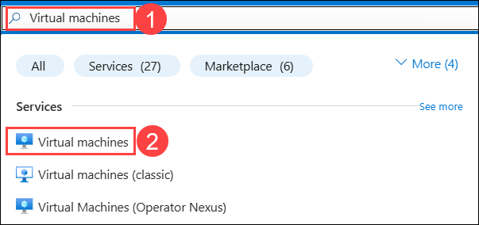

2. In the **Virtual machines** tab, select **+ Create** **(1)** and click on **Virtual machine** **(2)**.

    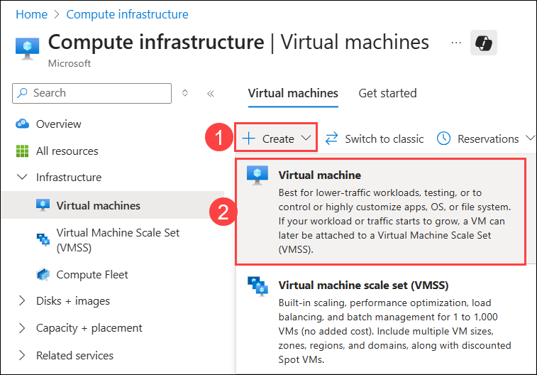

3. In the Create a virtual machine, enter the following details:

    - **Subscription**: Select available Subscription **(1).**
    - **Resource group**: Select **Appmod (2)**.
    - **Virtual machine name**: Provide a unique Virtual machine name (e.g. nvidia-gpu) **(3)**
    - **Region**: East US **(4)**
    - **Availability options**: from the drop-down, select **no infrastructure redundancy required (5)**
    - **Security type**: from the drop-down, select **Standard (6)**
    - **Image**: click on **see all images (7)**

       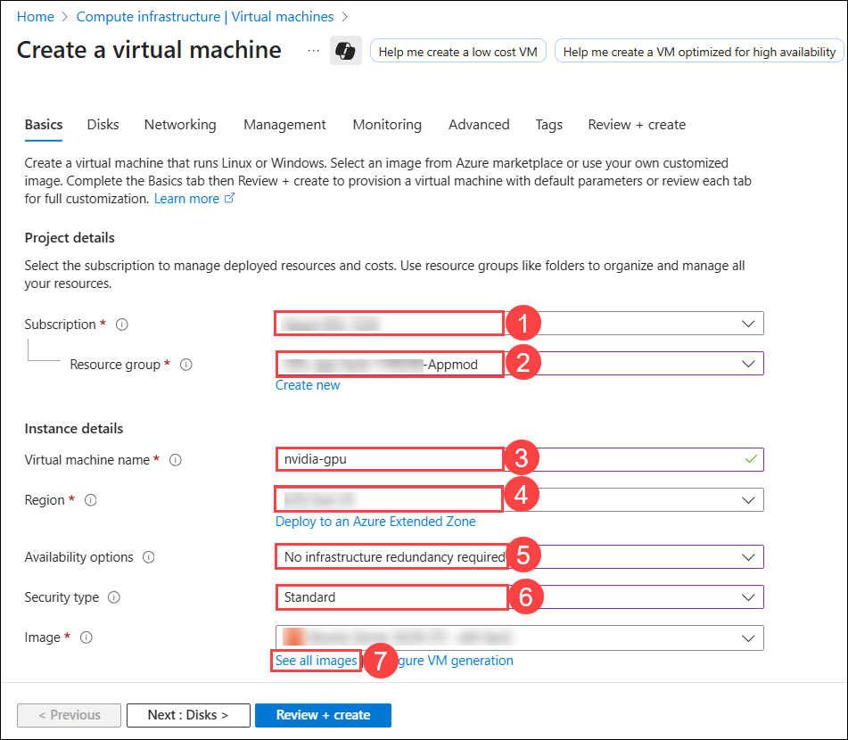

        - In the **MarketPlace**, search **NVIDIA GPU-Optimized VMI** **(1),** and in the **NVIDIA GPU-Optimized VMI,** click on **Select** **(2)** drop-down, and select **NVIDIA GPU-Optimized VMI - v24.10.1 - x64 Gen 2** **(3)** .

            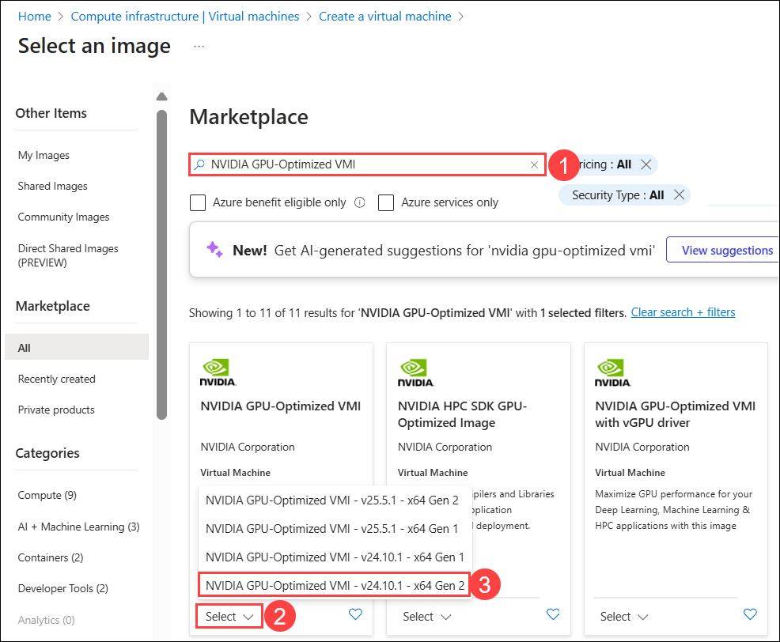

    - **Size**: Click on **See all sizes**.

       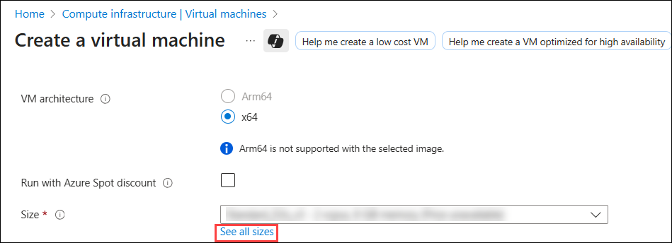 

        - In the **Select a VM size,** search **NC4as** **(1),** and select **NC4as_T4_v3** **(2),** and click on **Select** **(3)**.

            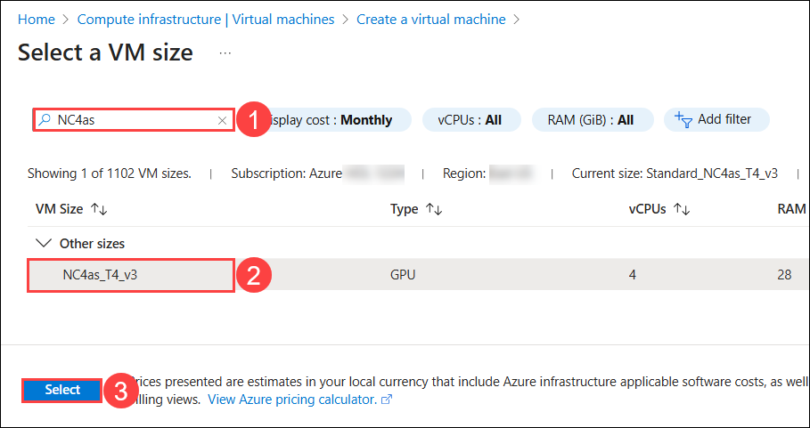

4. Under **Administrator account**, select the following details and click on **Next: Disks >** **(5)**

    - **Authentication type**: Select Password **(1)**
    - **Username**: Provide a Username for VM **(2)**
    - **password**: Enter the password **(3)**
    - **Confirm password**: Enter the password **(4)**

        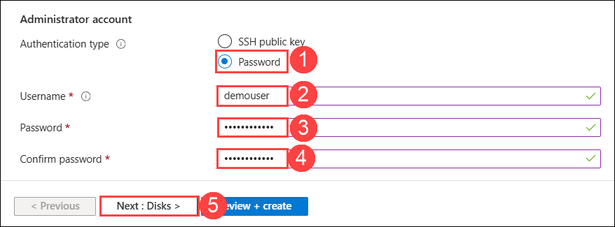

5. In the **Disks** tab, select the **OS disk size** from the drop-down **128 GiB** **(1)** and **OS disk type** as **Standard SSD (locally-redudant storage)** **(2)** and click on **Review + Create** **(3)**.

    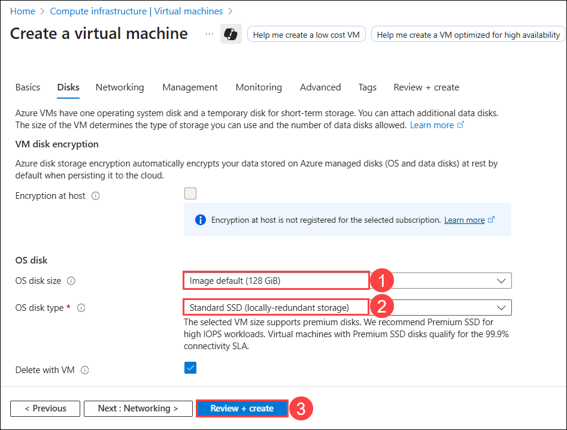

6. In the **Review + Create** tab, click on **Create**.

    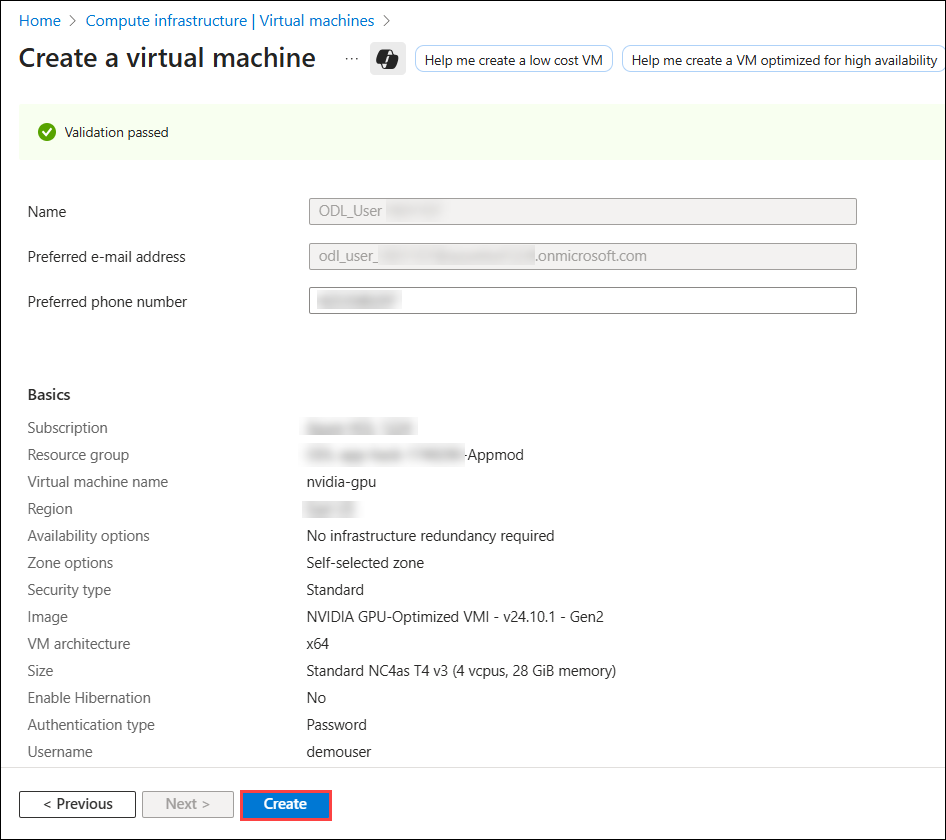

7. Once the deployment has succeeded, click on **Microsoft.Compute/virtualMachines**.

    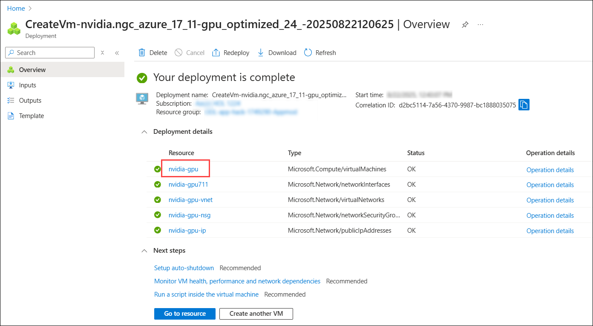

8. Expand the **Connect** tab and click on **Connect (1).** In Native SSH section, copy the **SSH command (2)** and paste it in notepad.

    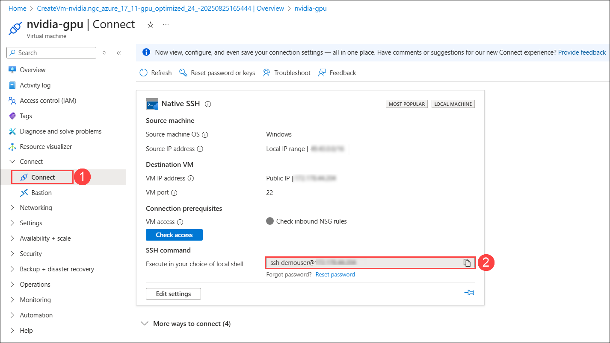

9. In the JumpVM, search for **cmd** **(1)** and select **Command Prompt** **(2)**.

    

10. In cmd paste the **SSh command (1)** you copied in step- 8, then hit **Enter** button.  In **Are you sure you want to continue Connection (yes/no/[fingerprint])?** enter **yes (2)**, then hit **Enter** button, and write the **password (3)**. Click on the Enter button again.
 
    >**Note:** The SSH command will be of below given format:
      `ssh Vmuser@<Public IP>`

      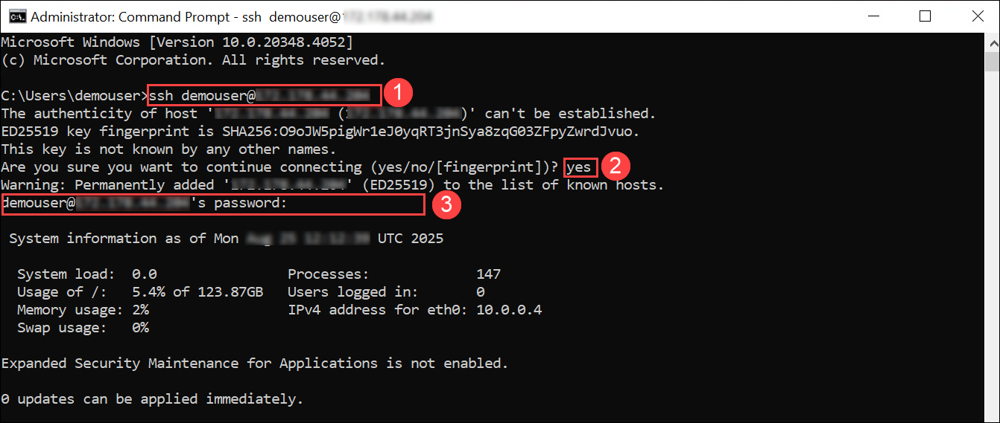

    >**Note:** Once you are connected to the virtual Machines, it takes 2-3 minutes to complete the setup process. Please wait till it gets completed.

### Task 3: Set Up and Run NVIDIA Riva ASR Container

1. Run the following command to set up the NVIDIA Container Toolkit by adding your user to the Docker group:
   
   ```bash
   sudo gpasswd -a $USER docker
   newgrp docker
   ```

   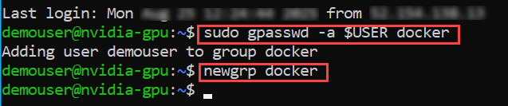   

2. Re-login into the VM by pasting the recorded **SSH command** . Hit the **Enter** button and include the **password**.

   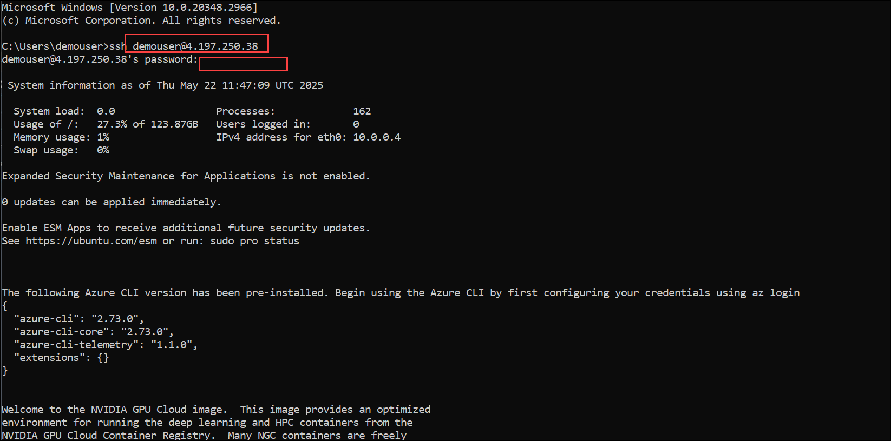

3. Run the following command to configure your NGC API Key:

   ```bash
   # Set your NGC API Key (replace with your actual key)
   export NGC_API_KEY="your-ngc-api-key"

   # Add to shell configuration for persistence
   echo "export NGC_API_KEY=your-ngc-api-key" >> ~/.bashrc

   # Log in to NGC container registry
   echo "$NGC_API_KEY" | docker login nvcr.io --username '$oauthtoken' --password-stdin
   ```
   

   > **Note**: Replace your-ngc-api-key with your generated NGC_API_KEY in task 1 or you can use below given NGC_API_KEY.

     ```
     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
     ```

4. Run the following command to download, deploy, and run the NVIDIA Riva model in Docker Desktop:
   
   ```bash
   # Set model selector
   export CONTAINER_ID=parakeet-1-1b-ctc-en-us
   export NIM_TAGS_SELECTOR="mode=all"

   # Run the container
   docker run -it --rm --name=$CONTAINER_ID \
   --runtime=nvidia \
   --gpus '"device=0"' \
   --shm-size=8GB \
   -e NGC_API_KEY \
   -e NIM_HTTP_API_PORT=9000 \
   -e NIM_GRPC_API_PORT=50051 \
   -p 9000:9000 \
   -p 50051:50051 \
   -e NIM_TAGS_SELECTOR \
   nvcr.io/nim/nvidia/$CONTAINER_ID:latest
   ```
   


   > **Note**: Setting up the NVIDIA Riva model within the Docker Desktop environment can be a time-consuming process. Depending on factors such as network speed and system performance, the setup procedure may take as long as one hour to complete. Please be patient and allow sufficient time for the installation and configuration to finish. Minimize the tab and proceed with the next challenge while monitoring the configuration every 20 minutes.

6. Once the NVIDIA Riva model has succeeded, start the new CMD session and connect it to the VM through SSH.

   

7. Run the following command to check if the service is ready to handle inference requests.

     ```
     curl -X 'GET' 'http://localhost:9000/v1/health/ready'
     ```

   - If the service is ready, you will get a response similar to the following.

     ```
     {"status":"ready"}
     ```

     


## Success Criteria

- Successfully generate the NGC API key through the NVIDIA build platform.
- Create and connect to a GPU-enabled virtual machine in Azure.
- Set up and run the NVIDIA Riva ASR container within the virtual machine.

## Additional Resources:

- [Getting Started — NVIDIA NIM Riva ASR](https://docs.nvidia.com/nim/riva/asr/latest/getting-started.html)
- [Python Client Repository](https://github.com/nvidia-riva/python-clients.git)
- [C++ Client Repository](https://github.com/nvidia-riva/cpp-clients.git)
